# Real-time GPU Raytracer using OpenGL Compute Shaders
A real-time GPU Raytracer, implemented using OpenGL Compute Shaders and C++. It has support for reflections, refractions, transparency and fresnel effects. It support multiple point and directional lights and hard shadows. It can display three different types of objects - spheres, boxes and meshes (loaded from an .obj file). The meshes are quite slow as no bounding volumes are currently used. The fresnel effects are also quite slow due to recursion limitations in OpenGL.
   
## Dependencies  
**SDL2** - for creating OpenGL context and handling input  
**GLEW** - needed for OpenGL Contex  
**GLM** - for vector/matrix math  
**STB** (included as submodule) - for loading and saving images  
**TinyObjLoader** (included as submodule) - for loading .obj files

## Build instructions   
1. Install the required dependencies: SDL2, GLEW and GLM.  `apt-get install libsdl2-dev, libglm-dev, libglew-dev`  
2. Clone the repo and the submodules (`git submodule update --init --recursive`)
3. Run `cmake` (on Windows you have to manually provide the locations of SDL2, GLM and GLEW through CMake root flags)  
4. You can now compile/modify the project  

## Showcase
### **Reflection**
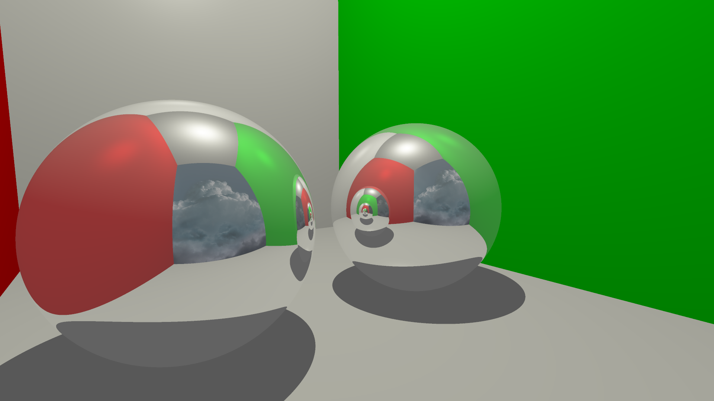
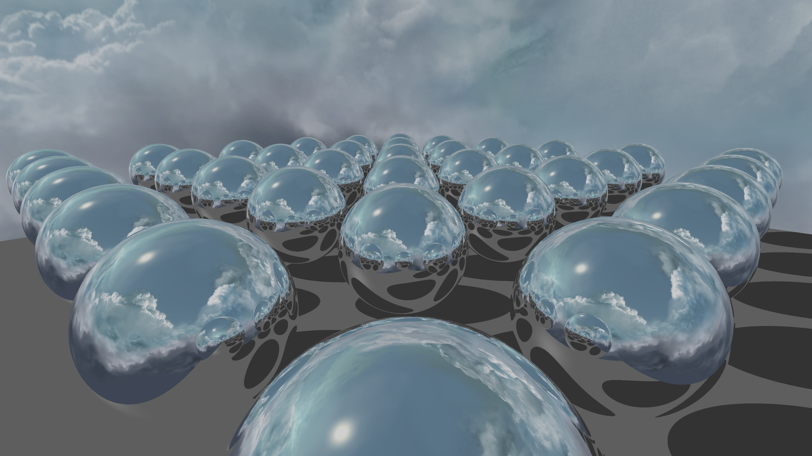
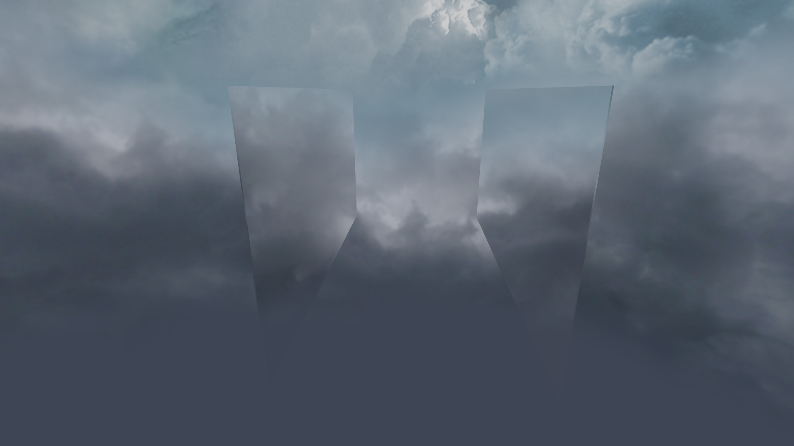
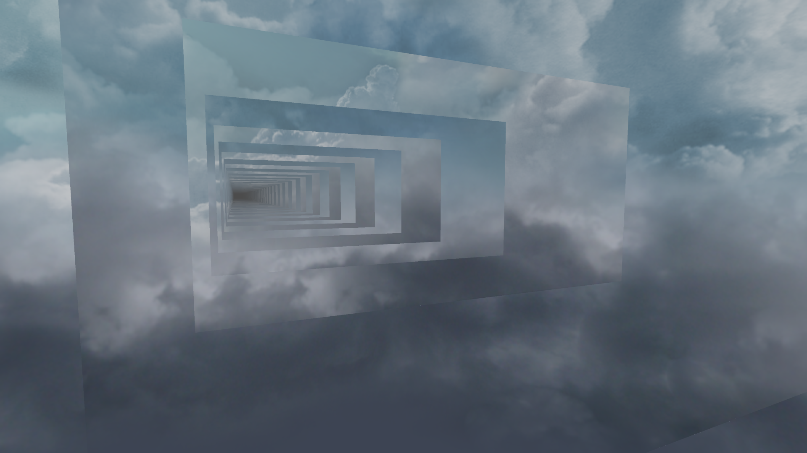

### **Refraction**
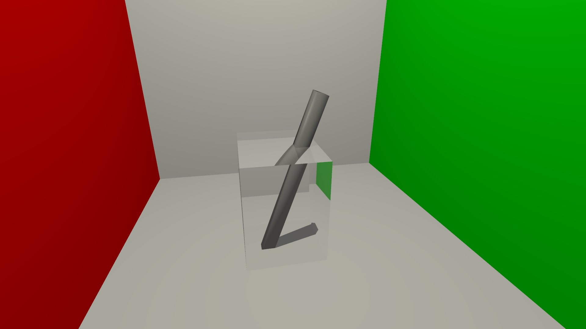
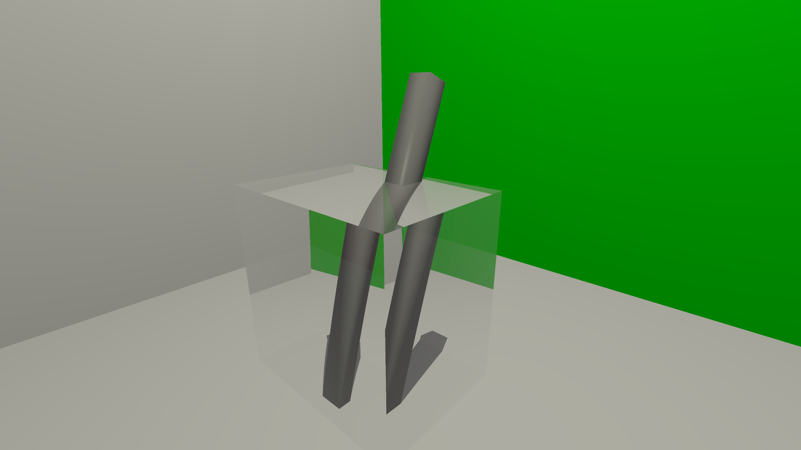
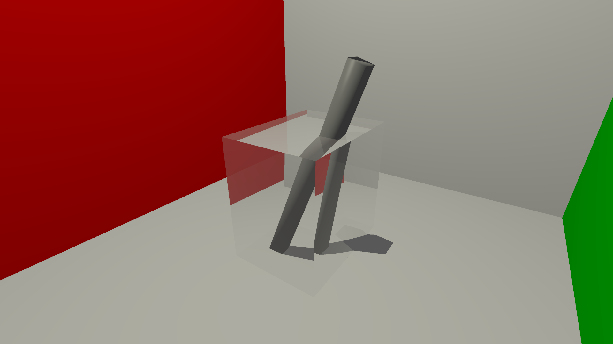
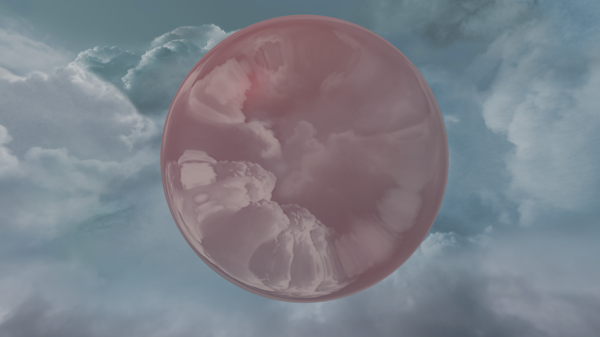

### **Fresnel**
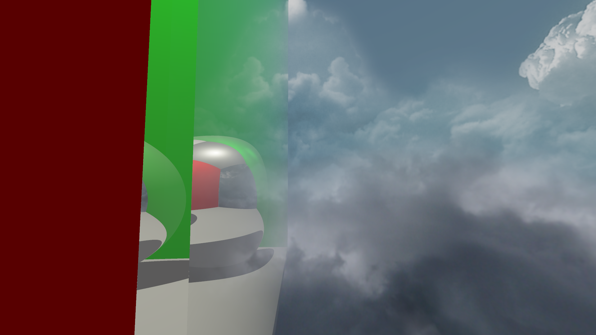

### **Lights and shadows**
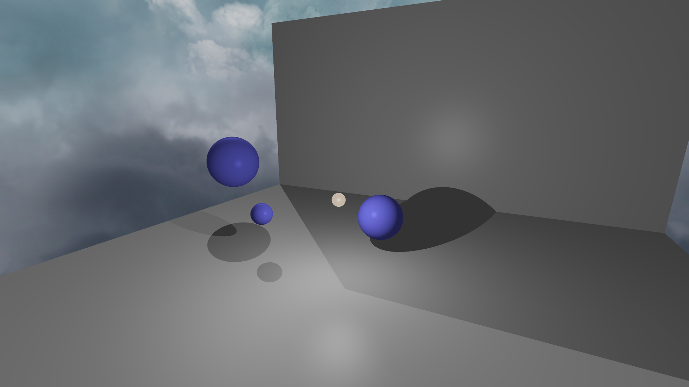

### **Meshes**
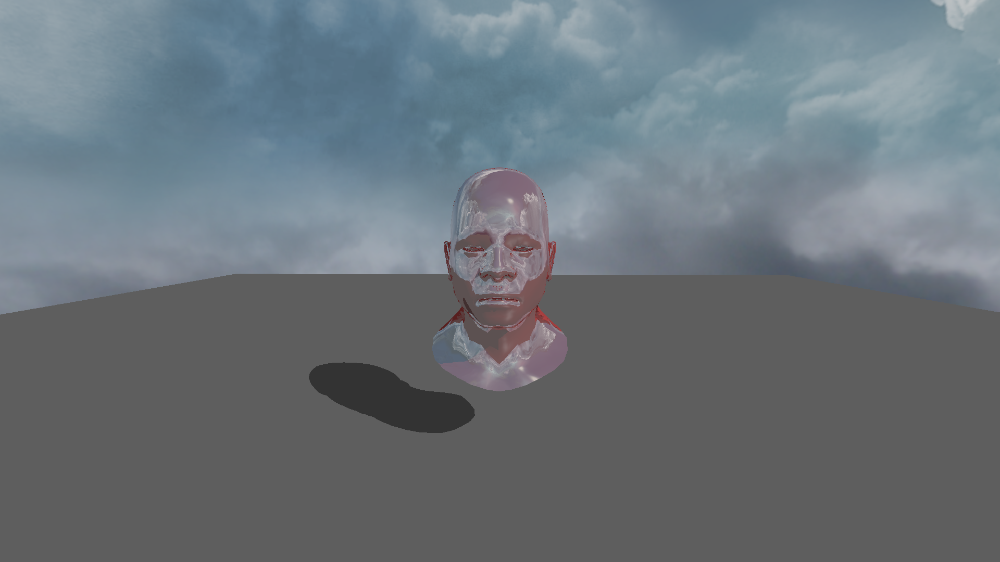

## Resources on the subject  
https://www.scratchapixel.com/ - Most comprehensive source online regarding raytracing and other rendering topics. Good explanations and includes code examples.  
  
http://antongerdelan.net/opengl/compute.html - Great introduction to Compute Shaders in relation to raytracing. 

https://github.com/LWJGL/lwjgl3-wiki/wiki/2.6.1.-Ray-tracing-with-OpenGL-Compute-Shaders-%28Part-I%29 - 
Website detailing the first steps of perspective correct raytracing. Good info but a bit rambly, no further tutorials as well.

http://blog.three-eyed-games.com/2018/05/03/gpu-ray-tracing-in-unity-part-1/ - Another good tutorial detailing the basics and later even very advanced topics. Only downside is it is targeted towards Unity and written in HLSL, not GLSL, but not a huge deal. 
 
http://web.archive.org/web/20070628033341/http://www.devmaster.net/articles/raytracing_series/part1.php - Old raytracing tutorial, only avaiable on archive.org 

http://raytracerchallenge.com/ - Another interesting website with ray tracing tutorials based on Tests, can be a bit confusing at times though.  

https://www.youtube.com/user/icytower103/videos - Channel showcasing a hybrid ray tracer which runs in real time with soft shadows and such, good info in comments.  